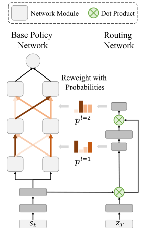

# Soft-Module

Implementation for "Multi-task Reinforcement Learning with Soft Modularization"

Paper Link: [Multi-Task Reinforcement Learning with Soft Modularization](https://arxiv.org/abs/2003.13661)



Our project page is at [https://rchalyang.github.io/SoftModule/](https://rchalyang.github.io/SoftModule/)

## Setup Environment

### Environement Requirements
* Python 3
* Pytorch 1.7
* posix_ipc
* tensorboardX
* tabulate, gym
* MetaWorld(Please check next section to set-up MetaWorld)
* seaborn(for plotting)

### MetaWorld Setup
We evaluated our method on [MetaWorld](https://meta-world.github.io).

Since [MetaWorld](https://meta-world.github.io) is under active development, we perform all the experiment on our forked MetaWorld(https://github.com/RchalYang/metaworld).

```
#Our MetaWorld installation
git clone https://github.com/RchalYang/metaworld.git
cd metaworld
pip install -e .
```

## Our Network Structure

See ```ModularGatedCascadeCondNet``` in ```torchrl/networks/nets.py``` for details

## Training

All log and snapshot would be stored logging directory. Logging directory is default to be "./log/EXPERIMENT_NAME". 

EXPERIMENT_NAME can be set with "--id" argument when start experiment. And prefix directory can be set with "--log_dir" argument)

```
# Modular Network // MT10-Conditioned // Shallow
python starter/mt_para_mtsac_modular_gated_cas.py --config meta_config/mt10/modular_2_2_2_256_reweight_rand.json --id MT10_Conditioned_Modular_Shallow --seed SEED --worker_nums 10 --eval_worker_nums 10


# Modular Network // MT10-Fixed // Shallow
python starter/mt_para_mtsac_modular_gated_cas.py --config meta_config/mt10/modular_2_2_2_256_reweight.json --id MT10_Fixed_Modular_Shallow --seed SEED --worker_nums 10 --eval_worker_nums 10


# Modular Network // MT10-Conditioned // Deep
python starter/mt_para_mtsac_modular_gated_cas.py --config meta_config/mt10/modular_4_4_2_128_reweight_rand.json --id MT10_Conditioned_Modular_Deep --seed SEED --worker_nums 10 --eval_worker_nums 10


# Modular Network // MT10-Fixed // Deep
python starter/mt_para_mtsac_modular_gated_cas.py --config meta_config/mt10/modular_4_4_2_128_reweight.json --id MT10_Fixed_Modular_Deep --seed SEED --worker_nums 10 --eval_worker_nums 10


# Modular Network // MT50-Conditioned // Shallow
python starter/mt_para_mtsac_modular_gated_cas.py --config meta_config/mt50/modular_2_2_2_256_reweight_rand.json --id MT50_Conditioned_Modular_Shallow --seed SEED --worker_nums 50 --eval_worker_nums 50


# Modular Network // MT50-Fixed // Shallow
python starter/mt_para_mtsac_modular_gated_cas.py --config meta_config/mt50/modular_2_2_2_256_reweight.json --id MT50_Fixed_Modular_Shallow --seed SEED --worker_nums 50 --eval_worker_nums 50


# Modular Network // MT50-Conditioned // Deep
python starter/mt_para_mtsac_modular_gated_cas.py --config meta_config/mt50/modular_4_4_2_128_reweight_rand.json --id MT50_Conditioned_Modular_Deep --seed SEED --worker_nums 50 --eval_worker_nums 50


# Modular Network // MT50-Fixed // Deep
python starter/mt_para_mtsac_modular_gated_cas.py --config meta_config/mt50/modular_4_4_2_128_reweight.json --id MT50_Fixed_Modular_Deep --seed SEED --worker_nums 50 --eval_worker_nums 50

```

## Plot Training Curve

To plot the training curves, you could use the following command.

* id argument is used for multiple experiment names.

* seed argument is used for multiple seeds

* replace "mean_success_rate" with different entry to see different curve for different entry.

```
python torchrl/utils/plot_csv.py --id EXPERIMENTS --env_name mt10 --entry "mean_success_rate" --add_tag POSTFIX_FOR_OUTPUT_FILES --seed SEEDS
```


## Citation

If you find our work useful, please cite our work.

```
@misc{yang2020multitask,
      title={Multi-Task Reinforcement Learning with Soft Modularization}, 
      author={Ruihan Yang and Huazhe Xu and Yi Wu and Xiaolong Wang},
      year={2020},
      eprint={2003.13661},
      archivePrefix={arXiv},
      primaryClass={cs.LG}
}
```
